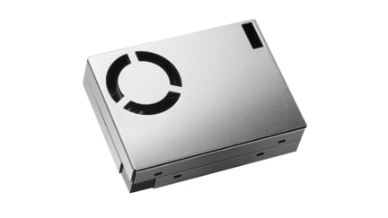

# RRH62000 external component for ESPHOME

The [RRH62000](https://www.renesas.com/en/products/sensor-products/environmental-sensors/intelligent-sensor-modules/rrh62000-all-one-integrated-sensor-module-pm2-5-rht-tvoc-and-eco2-detection) from Renesas is an all in one air quality module.

Particulate matter (PM1, PM2.5, PM10 referenced to KCI and cigarette smoke)

Number concentration of particle size (NC0.3, NC0.5, NC1, NC2.5, NC4

Total volatile organic compounds (TVOC)

Indoor Air Quality Index (IAQ) 

Estimated carbon dioxide concentration (eCO2)

Temperature (T) 

Relative humidity (RH)

## Hardware connection

The RRH62000 supports I2C and UART interface towards the host mcu. 
The current esphome external components is interfacing using the uart.

Power supply is 5V but the UART interface can directly communicate with the ESP32 on 3.3V logic.

