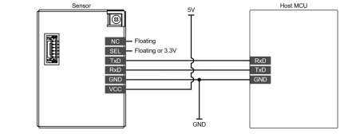

# RRH62000 external component for ESPHOME

The [RRH62000](https://www.renesas.com/en/products/sensor-products/environmental-sensors/intelligent-sensor-modules/rrh62000-all-one-integrated-sensor-module-pm2-5-rht-tvoc-and-eco2-detection) from Renesas is an all in one air quality module.


Particulate matter (PM1, PM2.5, PM10 referenced to KCI and cigarette smoke)

Number concentration of particle size (NC0.3, NC0.5, NC1, NC2.5, NC4)

Total volatile organic compounds (TVOC)

Indoor Air Quality Index (IAQ) 

Estimated carbon dioxide concentration (eCO2)

Temperature (T) 

Relative humidity (RH)

## Hardware connection

The RRH62000 supports I2C and UART interface towards the host mcu. 
The current esphome external component is interfacing using the uart.

Power supply is 5V but the UART interface can directly communicate with the ESP32 on 3.3V logic.
Connect GPIO13 to the RRH62000 TXD pin.
Currenlty there is no transmit towards the sensor.



Esphome config:
```
uart:
  - id: uart_1
    tx_pin: GPIO15
    rx_pin: GPIO13
    baud_rate: 9600
````
## Software setup

Below you can find an example how to enable the external components and its sensors in esphome yaml file.

Using the git repository (main or a specific branch can be selected)
````
external_components:
  source:
    type: git
    url: https://github.com/MarioEBV/esphome_external_components.git
    ref: v1.0.0
  components: [ RRH62000 ]
````

Enabling the sensors :
````
sensor:
  - platform: RRH62000
    temperature:
      name: "RRH62000 Temperature" 
    humidity:
      name: "RRH62000 Humidity"
    tvoc:
      name: "RRH62000 TVOC Value"
    eco2:
      name: "RRH62000 estimated CO2 Value"
    pm_1_0_kci:
      name: "RRH62000 PM1 KCI Value"
    pm_2_5_kci:
      name: "RRH62000 PM2.5 KCI Value"
    pm_10_0_kci:
      name: "RRH62000 PM10 KCI Value"
    pm_1_0_smoke:
      name: "RRH62000 PM1 smoke Value"
    pm_2_5_smoke:
      name: "RRH62000 PM2.5 smoke Value"
    pm_10_0_smoke:
      name: "RRH62000 PM10 smoke Value"
    nc_0_3:
      name: "RRH62000 NC03 Value"
    nc_0_5:
      name: "RRH62000 NC05 Value"
    nc_1:
      name: "RRH62000 NC1 Value"
    nc_2_5:
      name: "RRH62000 NC2.5 Value"
    nc_4:
      name: "RRH62000 NC4 Value"
    iaq:
      name: "RRH62000 IAQ level"
    update_interval: 60s
````

